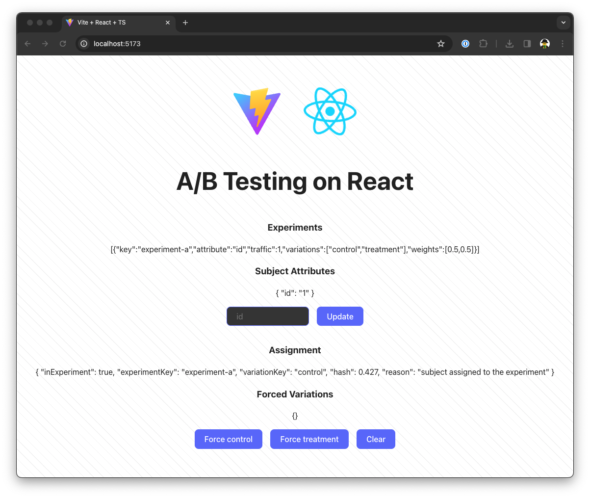

# Introduction to A/B Testing with React and React Native

## Getting Started

```bash
# Install dependencies
yarn

# Build the sdk
yarn workspace sdk build

# Start the react app
yarn workspace react dev
```



## Slides and Recording

The slides are available [here](https://drive.google.com/file/d/1UUVPzLVdhA6ILo-FCixktiId50Z6CRNg/view?usp=sharing).

The recording is available [here](https://youtu.be/1XOntVkLejw).

[](https://youtu.be/1XOntVkLejw)
